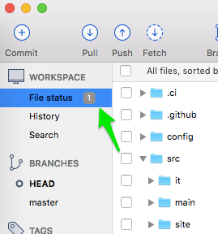
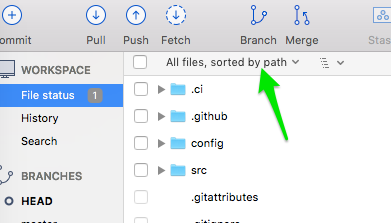
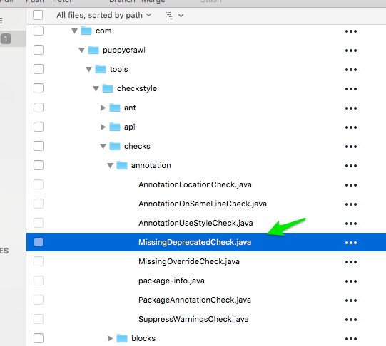
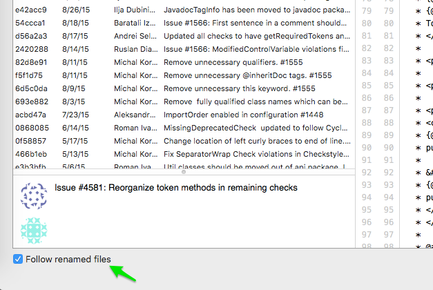
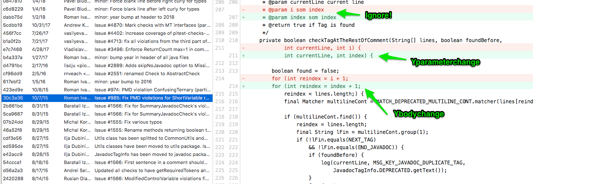
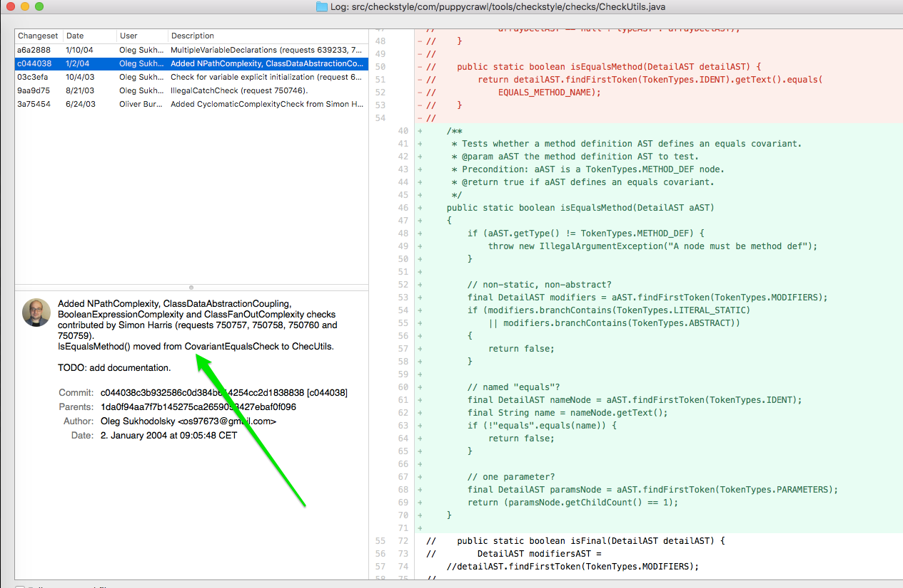
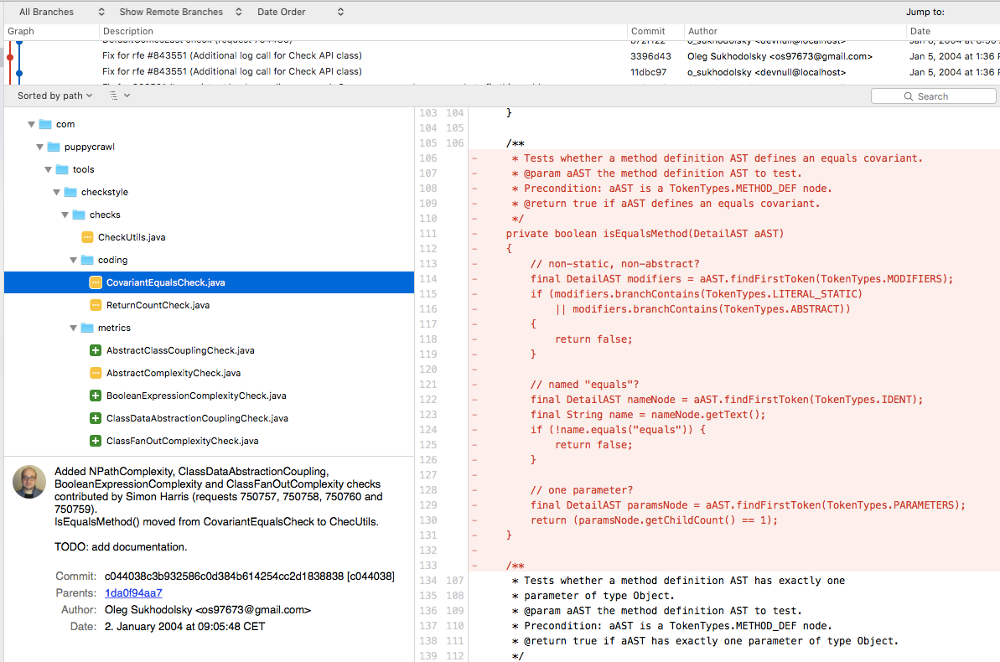

# Oracle Construction

This document describes how to construct a method history oracle. Accurately determining the full history of a method is laborous, but is necessary to check that a tool can effectively find all changes for a given method in a given language.

This document is mainly intended for people considering extending the oracle included in the repository (e.g., for extending to a new language) or building a new one. 

## Creating an Oracle

We need some oracles for CodeShovel evaluation purposes.
An oracle is a pool of method histories that we expect to be produced from CS.
Important is that these method histories are created manually and NOT using CS, so we can verify that CS works correctly.
Furthermore, two individual authors/evaluators should create the same oracle such that agreement on its correctness can be reached in advance.

Creating an oracle is pretty straight-forward but very tedious.
It is best done in phases where you need a break from other tasks requiring brain-power and want to do something more down-to-earth workers' work.

The following is a step-by-step manual on creating a history for a single method.
There are many tools and ways to create these histories; this is only one way that I found works for me.

### The Oracle spreadsheet

Our oracle is essentially a Google spreadsheet which can be found [HERE](https://docs.google.com/spreadsheets/d/1VCeFiyusHhHXBfCVVa0TdKfdPqKF4tfbLu_QInFuy7o/edit?usp=sharing).
The spreadsheet has multiple sheets. 

The first one is called repos and contains a list of repositories that we use for analysis. 
It should be pretty self-explanatory except three columns:
* HISTORYCOUNT: links to a file that shows the sorted number of revisions for each file in the repository
* START_COMMIT: the commit hash from which we start the analysis (i.e. the most current commit right now)
* SEARCH_PATHS: the paths in the repository containing the source files we are interested in

For each repository, we then create a separate sheet in which we write down our method histories.
Method histories are only two columns. 

The left column contains an identifier for the method that is analyzed in the format: `FILE_PATH#METHOD_NAME#START_LINE`, where:
* FILE_PATH: path to the file containing the method relative to the root dir of the repository
* METHOD_NAME: simple name of the method
* START_LINE: the line number in the file where the method name occurs

For example, the method identifier for the method [checkTagAtTheRestOfComment](https://github.com/checkstyle/checkstyle/blob/109e979909bd7235ab51a111cb6a14ff5ba2549d/src/main/java/com/puppycrawl/tools/checkstyle/checks/annotation/MissingDeprecatedCheck.java)
would be `src/main/java/com/puppycrawl/tools/checkstyle/checks/annotation/MissingDeprecatedCheck.java#checkTagAtTheRestOfComment:243`

The right column contains the expected CS method history as multiple lines in the form `COMMIT_HASH:CHANGE_TYPE`.

The change types are:
* `Yintroduced`: the method was introduced and occurs for the first time
* `Ymultichange`: container for multiple changes that happened in one commit
* `Yfilerename`: the file with the method was renamed OR the package structure changed
* `Ymovefromfile`: the method was moved from a different file
* `Yrename`: the method was renamed
* `Yparameterchange`: something in the method parameters changed (names or types)
* `Yreturntypechange`: the return type of the method changed (currently only Java)
* `Ymodifierchange`: the modifier was changed (public, private, protected, etc.)
* `Yexceptionschange`: the throws clause of the method changed (currently only Java)
* `Ybodychange`: method body was changed
* `Yparametermetachange`: something in the parameters changed except names or types (e.g. parameter annotation in Java)
* `Ymetachange`: some meta-information on the method was changed (currently only used for method annotations in Java)

For example, I found the method history for `src/main/java/com/puppycrawl/tools/checkstyle/checks/annotation/MissingDeprecatedCheck.java#checkTagAtTheRestOfComment:243` to be:
```
456f7cc:Ybodychange
b1a0f2b:Ybodychange
423ed9e:Ybodychange
30c3a36:Ymultichange(Yparameterchange,Ybodychange)
46a52f8:Yrename
2420288:Ybodychange
82d8e91:Ybodychange
6d5c0da:Ybodychange
0868085:Yintroduced
```

Important notes:
* Each commit has only a single change. If there are more than one change types in one commit, these changes must be bundled with `Ymultichange(CHANGE1, CHANGE2)`
* We neglect changes that changed merely the formatting or comments: whitespace changes, new lines, change location of braces and mere comment commits! We don't want such commits to appear in our history!
* Both changes in the file path (e.g. package rename in Java) and the file name (file rename) should be reflected as `Yfilerename` 


### How to find good methods

For each repo, I linked a file `historycount-REPONAME.out` in the `HISTORYCOUNT` column of the Repos sheet. The file is in the format `NUM_COMMITS - FILE_PATH` and the lines are sorted by `NUM_COMMITS` descending. This can be used as indicator where to find methods that have longer histories.

We are especially interested in methods that have at least, say, 10 commits and at least one "non-trivial" change type (e.g. `Ymethodmove`, `Yrename`). Essentially, we don't really want histories that have only `Ybodychange` types. But if you find out you're currently investigating one of those, better keep going anyway so we have quantity at least.

I started with files that have around 50 commits. I think this is a good number because it's likely you find methods in them that have 10+ commits, but the histories still won't last FOREVER. If you look at a file and search for an appropriate method, you'll have to guess what method may have a long history. Method size and "dominance" (i.e. a file with a single large method makes this method very dominant) should be taken into account. Or, if you run along the history of a method and you see that another method was being changed all the time, you might switch over or do this other method afterwards (or in parallel).

### How to create the history of a method

I'm using [SourceTree](https://www.sourcetreeapp.com/) to create method histories. While I'm not claiming it's the "best tool" for the job, we have found it works better than other tools. (If you decide you want to use the default git-log command and the terminal, please use this command: `git log --follow -M60% FILE_PATH` and don't consider FILE COPY operations. I have tried this as well but found that it just works better with SourceTree.)

(Side note: SourceTree is only available for MacOS and Windows. I hope no Linux user reads this.)

Here's a description of how it can be done with SourceTree:

1.) Clone the repo and make sure you're at the commit mentioned as START_COMMIT in the Repos sheet (`git checkout START_COMMIT`)

2.) Open the in SourceTree (New... > Add existing local repository)

3.) Open the history for the file. This is very annoying but it works...

3.1) Click on "File status" below "WORKSPACE" in the top left



3.2) Select "All files" in the dropdown to the right of "WORKSPACE":



3.3) File the file in the tree



3.4) Right-click on the file > Log selected...

3.5) Check "Follow renamed files" at the bottom left



4.) The tedious part: go through each revision and check if the method has been changed

4.1) If it has been changed, write down the hash and the change type

4.2) Here is a screenshot of the change `30c3a36:Ymultichange(Yparameterchange,Ybodychange)` in the previous example:



5.) Once you find the commit that seems to have introduced the message, you'll have to verify if this was "really" the introduction or if it was just a Ymethodmove, Yrename, etc.

5.1) For example, this looks like a method introduction on the right-hand side:



But the commit message on the left side already indicates that this method was in fact moved (of course there's not always such an obvious commit message).

5.2) We need to check other changes in this commit if this method was removed somewhere else!

5.3) Right-click on the revision in the file history (top left of the previous screenshot) > View in repository history

5.4) Browse through the changed files. We find that the method was removed somewhere else:



5.5) So in fact the history of the method continues here! Right-click on the file (selected item in the previous screenshot) > Log selected...

5.6) Continue as before (you might notice some recursion here which is in fact exactly the algorithm of CS)

6.) At some point you'll find the commit that really introduced the method. You can finish your analysis with a `Yintroduced` change type. Congrats!


## Tool comparison

```
https://github.com/ataraxie/codeshovel/blob/master/analysis/compare_100_methods.ods
```

The above file contains the results of tool comparison (comparing CodeShovel's accuracy with git log, intelliJ, and FinerGit). For a method, 1 means the tool successfully generated the complete history of the method, and 0 means the tool failed. This result was published in our ICSE 2021 paper.  

